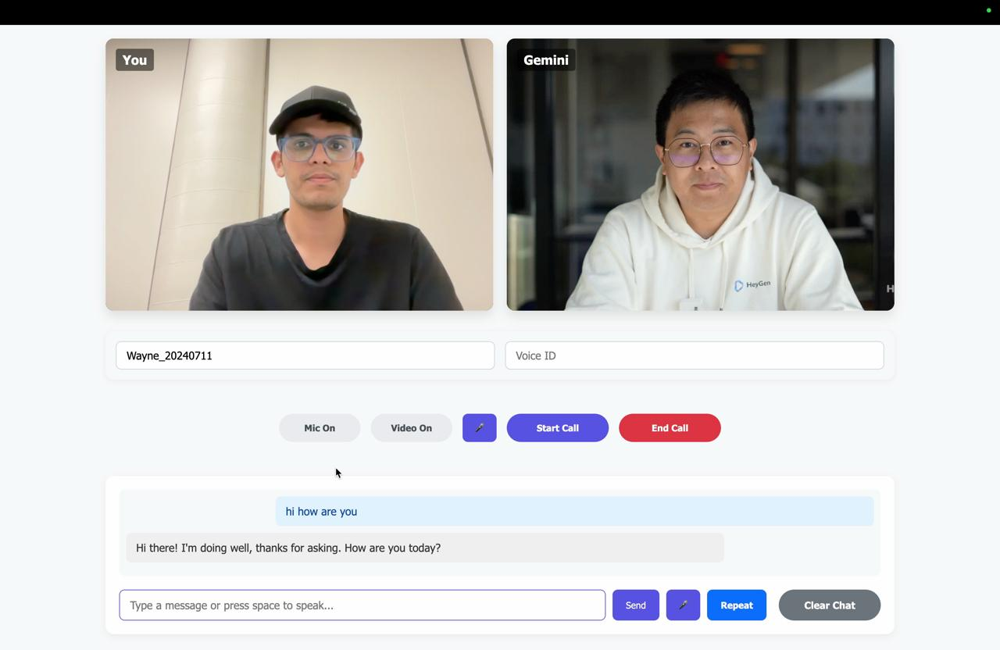

# HavenAI-Live-VideoCall-with-AI-Agent

A real-time video chat application that uses Google's Gemini Flash model for conversations and renders the AI's responses through a HeyGen AI avatar.


## Features

- Real-time audio/video communication using WebRTC
- Speech-to-text conversion for user input
- Integration with Google's Gemini AI for intelligent responses
- Text-to-speech conversion for Gemini's responses
- HeyGen AI avatar video generation for a visual representation of Gemini

## Prerequisites

- Node.js and npm installed
- Google Gemini API key
- HeyGen API key

## Setup

1. Clone this repository
2. Install dependencies:
   ```
   npm install
   ```
3. Create a `.env` file in the root directory with the following variables:
   ```
   GEMINI_API_KEY=your_gemini_api_key
   HEYGEN_API_KEY=your_heygen_api_key
   ```
4. Start the development server:
   ```
   npm run dev
   ```
5. In a separate terminal, start the client:
   ```
   npm run client
   ```
6. Open your browser and navigate to `http://localhost:1234`

## How It Works

1. User speaks into their microphone
2. Speech is converted to text using the Web Speech API
3. Text is sent to Gemini flash model for processing
4. Gemini's response is sent to HeyGen to generate an avatar video
5. The avatar video is displayed to the user through WebRTC

## Technologies Used

- WebRTC for real-time communication
- Google's Gemini AI for natural language processing
- HeyGen API for AI avatar video generation
- Web Speech API for speech recognition
- Socket.io for signaling
- Express.js for the backend server
